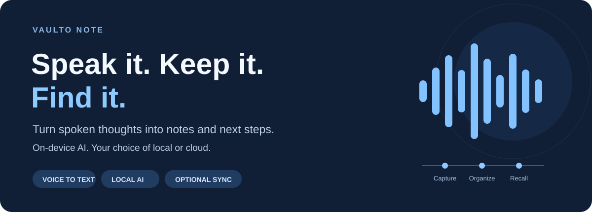
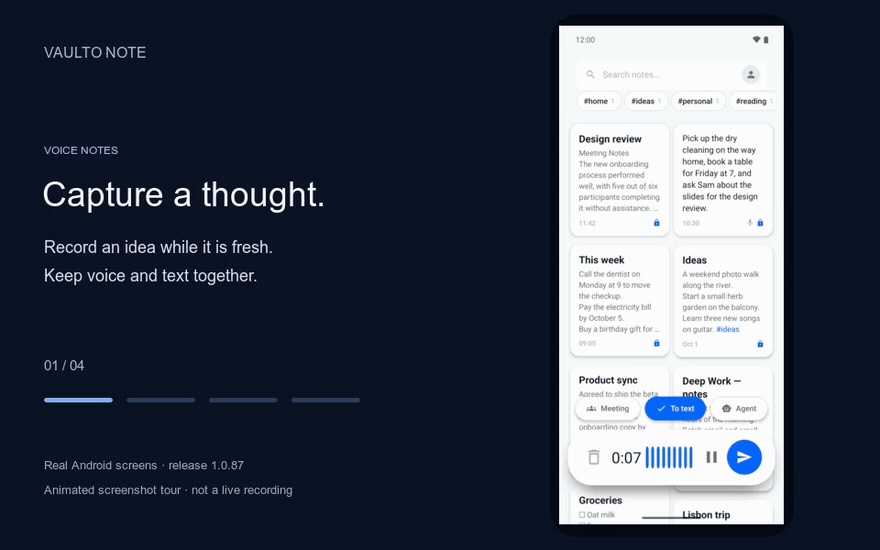
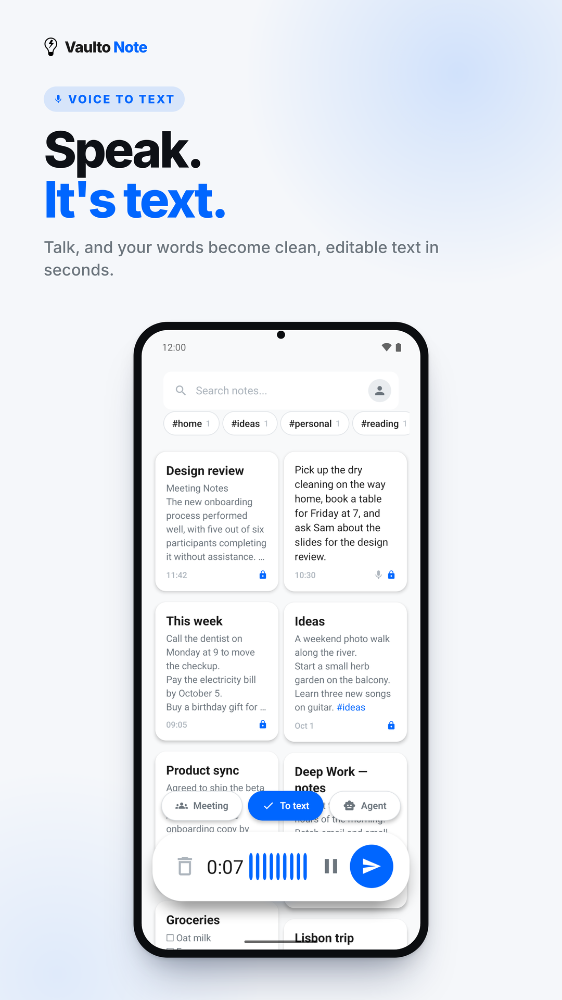
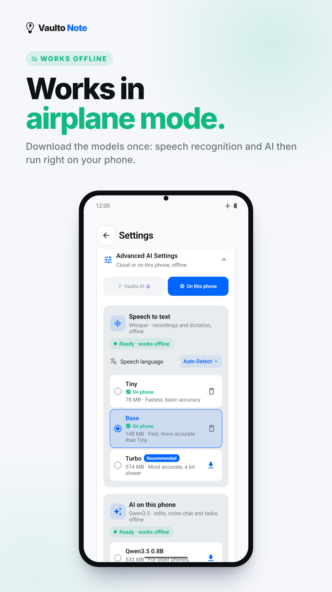
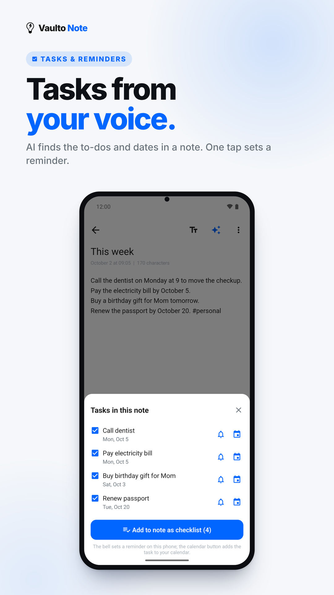
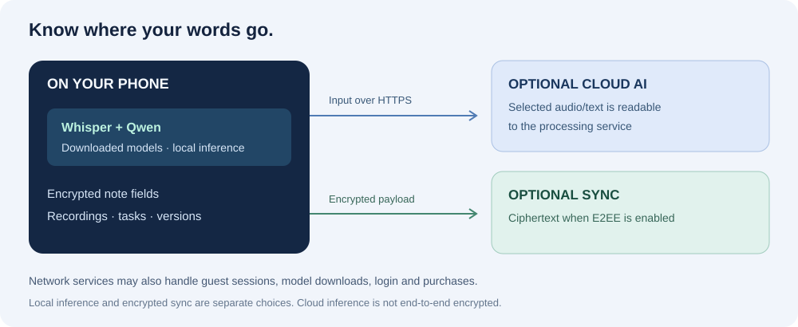

<p align="center">
  
</p>

<p align="center">
  <strong>Voice notes that become readable text, useful tasks, and answers.</strong><br>
  Run speech recognition and AI on your phone, or choose optional cloud features.
</p>

<p align="center">
  <a href="https://play.google.com/store/apps/details?id=com.vaultonotemobile"></a>
  <a href="LICENSE"></a>
  <a href="docs/PRIVACY.md"></a>
</p>

<p align="center">
  <a href="#a-quick-look">See it</a> ·
  <a href="#what-you-can-do">Features</a> ·
  <a href="#local-or-cloud-your-choice">Local &amp; cloud</a> ·
  <a href="#build-and-explore">Build</a> ·
  <a href="CONTRIBUTING.md">Contribute</a> ·
  <a href="https://github.com/dirusanov/vaulto_note_mobile/issues">Feedback</a> ·
  <a href="https://vaultonote.com">Website</a>
</p>

## A quick look

<p align="center">
  
</p>

*This is an animated tour of real app screenshots, not a live recording or a speed benchmark. Screens were captured in Android release 1.0.87 and may differ from the latest release. AI output in these screens was generated on the device. [Media provenance and regeneration](docs/media/README.md).*

Record an idea while it's fresh. Turn the transcript into something you can use later: a clearer note, a checklist, a reminder, or an answer from your saved notes.

<table>
  <tr>
    <td align="center"><strong>Capture a thought</strong></td>
    <td align="center"><strong>Take it offline</strong></td>
    <td align="center"><strong>Turn it into action</strong></td>
  </tr>
  <tr>
    <td></td>
    <td></td>
    <td></td>
  </tr>
</table>

## What you can do

| Capture | Make it useful | Keep it yours |
| --- | --- | --- |
| Record and transcribe voice notes | Clean up, summarize, or restructure text | Use local notes without creating an account |
| Start from a widget or Quick Settings tile | Extract tasks and set reminders | Run Whisper and Qwen on the phone |
| Share text, links, and audio into Vaulto | Ask questions across saved notes | Choose optional end-to-end encrypted sync |
| Import Markdown, text, or Google Keep exports | Keep AI edits as versions | Export notes as Markdown |

Also includes meeting notes, tags, pinned notes, dark theme, app lock, tablet layouts, and a trash folder. See the [changelog](CHANGELOG.md) for release details.

## Local or cloud: your choice

**Local processing is free.** Download the speech and AI models once, then use on-device transcription and AI without an internet connection. Model downloads take storage, and speed and quality depend on the device and selected model. A model download needs internet access.

**Cloud features are optional.** They can help you get started without downloading models. Cloud transcription and AI send the relevant audio or text for server processing. Pro subscriptions add cloud allowances and sync features; Google Play shows current prices and billing periods before purchase.

**Local AI does not mean the entire app is network-free.** Guest sessions, account features, model downloads, purchases, and enabled sync can contact services. End-to-end encryption of sync also does not make cloud AI inference end-to-end encrypted. [Read the data-flow explanation and inspect the implementation](docs/PRIVACY.md).

<p align="center">
  
</p>

## Build and explore

This repository contains the React Native / Expo **mobile client**, including its native Android and iOS projects. The hosted backend is maintained separately. Android is available on Google Play; inclusion of iOS source does not imply a public iOS release.

Use a native development build: Expo Go cannot load the Whisper, llama, and custom native modules in this project.

```bash
git clone https://github.com/dirusanov/vaulto_note_mobile.git
cd vaulto_note_mobile
npm ci
cp .env.example .env
# Configure your development service endpoints in .env.
npm run android
```

Set up the Android SDK and JDK 17 before building. Exact tooling, configuration, backend dependencies, and iOS notes are in the [development guide](docs/DEVELOPMENT.md). Signed release builds require your own signing credentials; the official application's upload key is not part of this repository.

Run the existing checks:

```bash
npm test
```

### Where to look in the code

| Area | Implementation |
| --- | --- |
| Local speech recognition | [LocalWhisperService.ts](src/services/LocalWhisperService.ts) |
| Local AI and device-aware model selection | [LocalLLMService.ts](src/services/LocalLLMService.ts), [offlineMode.ts](src/services/offlineMode.ts) |
| Local note encryption | [encryption.ts](src/crypto/encryption.ts), [DatabaseService.ts](src/services/DatabaseService.ts) |
| Sync keys and encrypted payloads | [e2ee.ts](src/crypto/e2ee.ts), [SyncService.ts](src/services/SyncService.ts) |
| Android key backup | [KeyBackupModule.kt](android/app/src/main/java/com/vaultonotemobile/KeyBackupModule.kt) |
| Import and export | [notesTransfer.ts](src/services/notesTransfer.ts) |

## Feedback and contributions

Report a reproducible bug or suggest a use case through [GitHub Issues](https://github.com/dirusanov/vaulto_note_mobile/issues). Include the device, app version, local/cloud mode, and steps to reproduce. Use sample content instead of private notes. [Contribution guide](CONTRIBUTING.md).

For a security issue, use the private reporting route in [SECURITY.md](SECURITY.md).

## License and project status

The mobile client is open source under the **[GNU General Public License v3.0](LICENSE)** (`GPL-3.0-only`). Commercial use is allowed. Distribution of modified versions carries source and same-license obligations; see the license for the complete terms. Copyright © 2026 Dmitrii Rusanov and contributors.

The hosted service is maintained separately and is not included in this repository. [Third-party notices](THIRD_PARTY_NOTICES.md).

Whisper and Qwen model weights are downloaded from upstream projects and have their own licensing terms. They are not bundled in the repository; publishing the app source does not relicense dependencies or model weights.

---

<p align="center">
  <strong>Your thoughts belong to you.</strong><br>
  <a href="https://play.google.com/store/apps/details?id=com.vaultonotemobile">Try Vaulto on Android</a> ·
  <a href="https://vaultonote.com/privacy">Privacy policy</a> ·
  <a href="https://vaultonote.com">Website</a>
</p>
